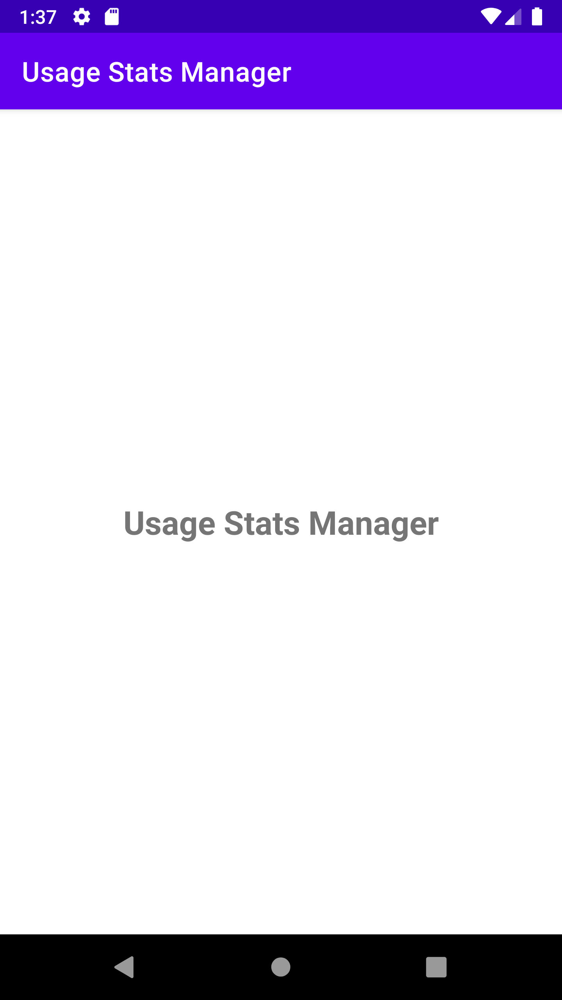
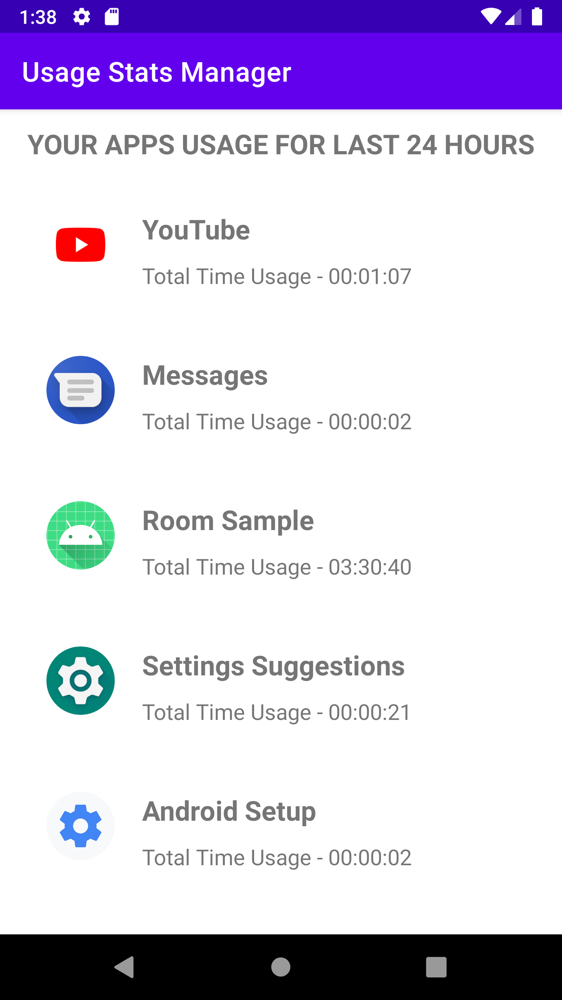

# android-usagestas
A sample aaplication can display a list of all apllications used in Android mobile phone for last 24 hours.

==============================================
# android-permission
       
        
```
 <uses-permission
        android:name="android.permission.PACKAGE_USAGE_STATS"
        tools:ignore="ProtectedPermissions" />
```
        
==============================================
 ### Screenshots
    
